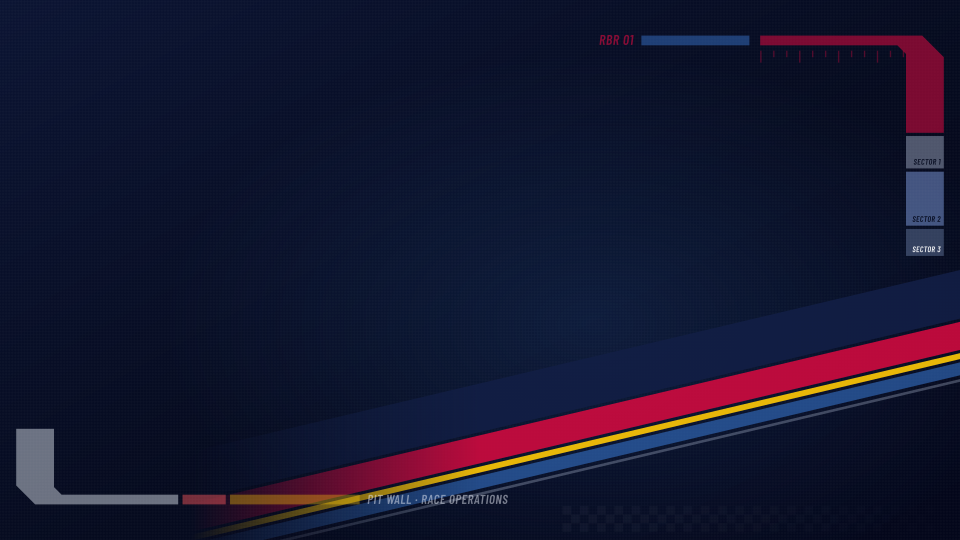
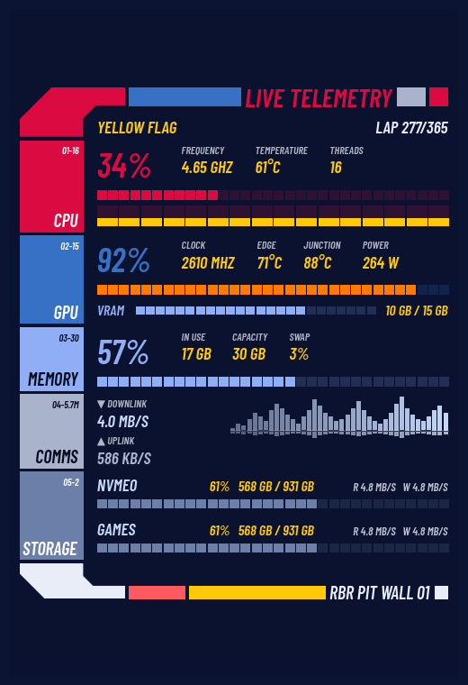
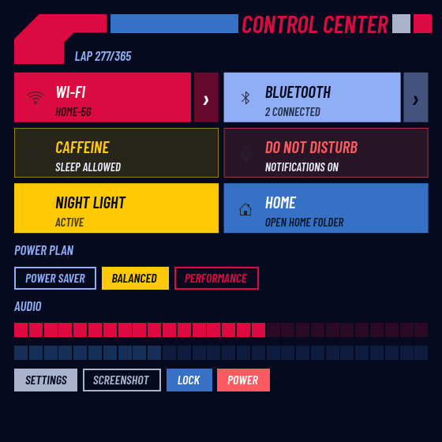
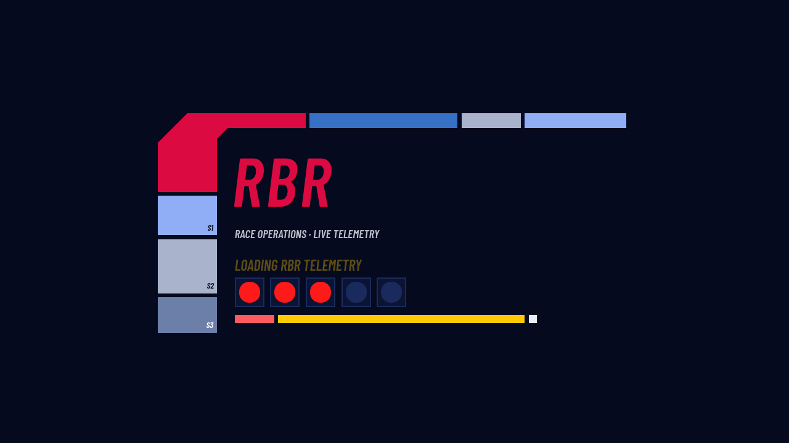

# RBR Desktop for KDE Plasma 6

An F1 Red Bull Racing–style look for KDE Plasma 6 (matte navy, red, yellow and team blue,
angular pit-wall graphics): a global theme, a system monitor widget,
a control center, a notification center with RBR popups, a Meta+G audio overlay,
an icon set and an RBR fastfetch, plus a script that sets it all up.



| System Monitor | Control Center |
|---|---|
|  |  |

**Boot splash:** five red start lights come on while Plasma loads, then "lights out and away we go".



<sub>These are offscreen renders of the widgets with sample data, not desktop screenshots.</sub>

---

## ⚠️ Read this first

**This project is 90+% vibe coded.** Most of the code was written by an AI
(Claude) while I described what I wanted, tested it and asked for changes. I am
not a QML or Plasma developer. It works on my machine, and that is the only
promise I can make.

**Use it at your own risk.** The setup script
replaces the panels on your main screen, changes KDE settings and keeps KDE's own
Do Not Disturb switched on so the RBR popups can take over notifications.
Read the code before you run it, at least `setup.sh`, and try
`./setup.sh --dry-run` first. If you are not comfortable checking what a script does
to your system, don't run this one.

**No support.** I won't answer questions, fix bugs on request or help get it
running on your setup. Issues and pull requests may sit unanswered. You are
responsible for keeping it updated, maintained and secure on your own system.
I will push updates here when I change things on my own desktop. Feel free to
fork it.

**Why is it public at all?** It never was meant to be. I built it for my own
desktop. After I posted screenshots on Reddit, enough people asked for it
and said they didn't mind that it's vibe coded, so here it is, as is. If AI-written
code bothers you, this repo isn't for you, and that's fine.

---

## What's in it

| Part | Folder | What it does |
|---|---|---|
| Global theme | `payload/projects/rbr-theme/` | Plasma Style, colour scheme, window decoration, wallpaper, splash, all named **RBR** |
| System Monitor | `payload/projects/rbr-monitor/` | CPU, GPU, memory, network and disks, as a desktop or panel widget |
| Control Center | `payload/projects/rbr-control/` | Wi-Fi, Bluetooth, power profiles, caffeine, Do Not Disturb, Night Light, volume, quick actions |
| Notification Center | `payload/projects/rbr-control/` | Notification history and RBR-styled popups that replace KDE's |
| Audio overlay | `payload/projects/rbr-audio/` | Game Bar–style volume panel on **Meta+G**, drawn over everything |
| Icons | `payload/projects/rbr-icons/` | 102 RBR icons; everything else falls back to kora, then Breeze |
| Terminal | `payload/fastfetch/`, `payload/fish/` | RBR fastfetch with a chequered flag and a lap counter (the year is the race, each day a lap); fish commands `rbr-fetch` and `rbr-test` |
| Plain audio overlay | `extras/kde-audio-overlay/` | The Meta+G overlay with a normal Breeze look (not installed by setup) |

The full guide to every part, including how to change and remove it, is
[`payload/RBR-HOWTO.md`](payload/RBR-HOWTO.md).

## Requirements

**No sudo needed.** `setup.sh` never asks for your password: everything goes into
your home folder (`~/.local/share`, `~/.config`). It only *checks* for the packages
below and tells you which ones are missing. Installing them is up to you. Most come
with a normal Plasma 6 install already.

- KDE Plasma 6 in a **Wayland** session (the overlay and popups need Wayland)
- Made and tested on **CachyOS / Arch**. Fedora package names are included as a best guess. On other distros, look up the equivalents.

| What | Arch / CachyOS | Fedora | Needed for |
|---|---|---|---|
| Qt 6 QML runtime | `qt6-declarative` | `qt6-qtdeclarative` | Everything |
| Kirigami, KItemModels | `kirigami` `kitemmodels` | `kf6-kirigami` `kf6-kitemmodels` | All widgets |
| Layer shell | `layer-shell-qt` | `layer-shell-qt` | Meta+G audio overlay, RBR popups |
| Plasma audio | `plasma-pa` | `plasma-pa` | Audio overlay, volume sliders |
| Network | `plasma-nm` | `plasma-nm` | Control Center Wi-Fi |
| Bluetooth | `bluez-qt` `bluedevil` | `kf6-bluez-qt` `bluedevil` | Control Center Bluetooth |
| Power | `powerdevil` `power-profiles-daemon` (or `tuned-ppd`) | `powerdevil` `power-profiles-daemon` | Power plan, caffeine, Night Light |
| Sensors | `libksysguard` `ksystemstats` | `libksysguard` `ksystemstats` | System Monitor, hardware detection |
| bsdtar | `libarchive` | `bsdtar` | Building the Control/Notification widgets |
| fastfetch | `fastfetch` | `fastfetch` | RBR terminal greeting (optional) |
| notify-send | `libnotify` | `libnotify` | `rbr-test` command (optional) |

Arch / CachyOS, all at once:

```sh
sudo pacman -S --needed qt6-declarative kirigami kitemmodels layer-shell-qt plasma-pa plasma-nm \
  bluez-qt bluedevil powerdevil power-profiles-daemon libksysguard ksystemstats libarchive fastfetch libnotify
```

If you leave a package out, only the part that needs it stops working.

**Optional extras** (not bundled, used if installed):

- [kora](https://github.com/bikass/kora) icons. The RBR icons fall back to them.
- [WhiteSur cursors](https://github.com/vinceliuice/WhiteSur-cursors).
- Qt 5 apps such as VLC follow the theme with `plasma5-integration` `breeze5` (Fedora: `plasma-integration-qt5` `breeze-qt5`).

## Install

```sh
git clone https://github.com/Sjengstah/rbr-desktop.git
cd rbr-desktop
less setup.sh             # read it
./setup.sh --dry-run      # see what it would do
./setup.sh
```

Then:

1. **Log out and back in once** so Meta+G and the widget hotkeys work.
2. Hide the crossed-out bell in the system tray (System Tray → Configure →
   Entries → Notifications → Always hidden). **Don't disable it**: it runs KDE's
   notification service.
3. The RBR icons are installed but not switched on: System Settings → Icons → RBR.

Setup copies your current Plasma/KWin/GTK settings to
`~/.config/rbr-kit-backup-<time>/` before it changes anything.

### Only the parts you want, no script

Each part also installs on its own, as your normal user:

```sh
# Widgets (System Monitor, Control Center, Notification Center)
kpackagetool6 -t Plasma/Applet -i payload/projects/rbr-monitor/package
cd payload/projects/rbr-control && ./build.sh install && cd -

# Global theme, icons, audio overlay
payload/projects/rbr-theme/install.sh
payload/projects/rbr-icons/install.sh
payload/projects/rbr-audio/install.sh
```

Then add the widgets: right-click a panel → Add or Manage Widgets → search
**RBR**. Apply the theme in System Settings → Colors & Themes → Global Theme → RBR.
See the HOWTO for each part.

## Undo

- Theme: System Settings → Colors & Themes → Global Theme → pick another one.
- RBR popups: Notification Center → Configure → untick "Replace KDE's notification popups".
- Widgets: remove them from the panel, then `kpackagetool6 -t Plasma/Applet -r <id>`.
- Audio overlay: `payload/projects/rbr-audio/uninstall.sh`.
- GTK 4 colours: delete the `RBR-BEGIN` … `RBR-END` block in `~/.config/gtk-4.0/gtk.css`.
- Flatpak theme access: `flatpak override --user --reset`.
- Old settings: copy files back from `~/.config/rbr-kit-backup-<time>/`.

## Credits and licences

- Code in this repository: **GPL-3.0-or-later** (see [LICENSE](LICENSE)), unless a file or folder says otherwise.
- RBR Plasma Style and window decoration are based on **Carl** by **jomada**
  (Plasma Style LGPL, Aurorae decoration GPL-3.0). Credit is kept in their metadata.
- **Barlow Condensed** font (SemiBold Italic) by Jeremy Tribby: SIL Open Font License (`OFL.txt` next to each copy).
- The generated RBR wallpaper: CC-BY-SA-4.0.
- Red Bull, Red Bull Racing and Formula 1 are trademarks of their respective owners. This is an unofficial fan project that only borrows a colour palette; it contains no team logos or artwork and is not affiliated with or endorsed by them.
- Forked from the [LCARS desktop](https://github.com/Sjengstah/lcars-desktop); the layout and code structure are the same.
- Written with a lot of help from Claude (Anthropic).

THIS SOFTWARE IS PROVIDED "AS IS", WITHOUT WARRANTY OF ANY KIND. See the LICENSE for the full terms.
